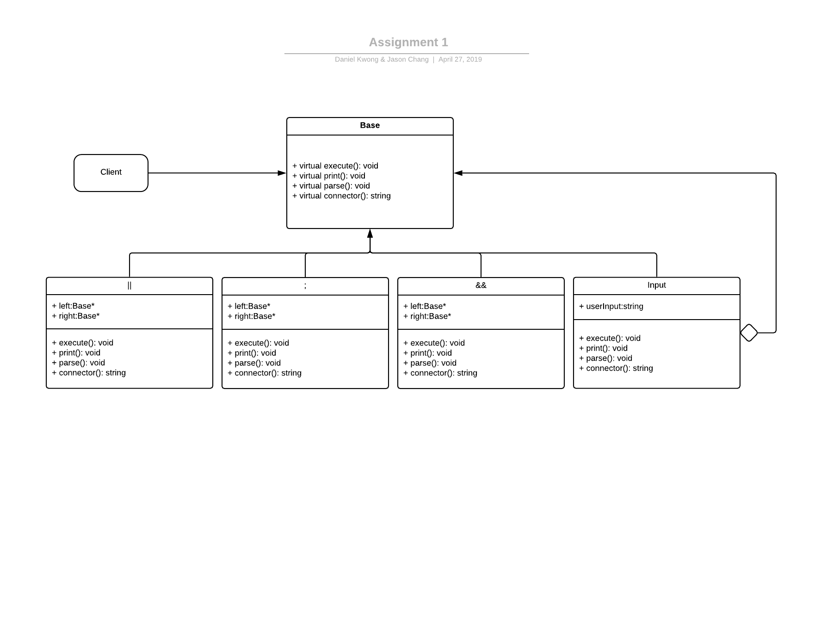

# CS100 RShell
> Spring 2019 - Daniel Kwong (862032167) and Jason Chang (862046747)

## Introduction
Our program will be a basic command shell that will be created using C++. The shell will be able to take in and execute standard commands. It will also have 3 connectors: "||", "&&", and ";". They will allow the user to run multiple commands at once. The composite pattern will be used to handle all commands and operators. We plan on having a base class that connects all of the classes together as an interface. The subclasses will include a regular input class that will take in and execute the commands and operator classes that will build a tree using the operators and command inputs.

## Diagram

## Classes

### client.cpp
* `parse()` - Provides the interface in which the user can use the console/shell. Takes user input.

### base.h
Base class, holds virtual functions.

* `execute()` - returns true or false if command executed properly
* `parse()` - parses / splits strings for certain args

### connector.h
Connector class, also holds virtual functions. Serves as a platform for connecting commands whilst helping build our tree stack.

* `Base* left, right` - storage unit for the commands that need to be connected
* `execute()`
* `getCommand()`

### command.cpp
Process command function, takes in parameter string.

* `execute()`
* We also added a TestCommand executor that is tailored specifically for the test command.

### and.cpp
Also known as “&&” next command executed only if the first command succeeds.

* `Base* left, right`

* `execute()`

* `getCommand()`


### pipe.cpp
Also known as “||” next command executed only if the first command fails. NOTE: we named this class before we knew that we had to do the pipe operator, thus we called the actual pipe operator "iopipe.cpp".

* `Base* left, right`

* `execute()`

* `getCommand()`


### semi.cpp
Also known as “;” next command is always executed.

* `Base* left, right`

* `execute()`

* `getCommand()`

### input.cpp
Handles IO redirection for input "<"

* `Base* left, right`

* `execute()`

* `getCommand()`

### iopipe.cpp
Also known as “|”, handles the operator pipe.

* `Base* left, right`

* `execute()`

* `getCommand()`

### input.cpp
Handles IO redirection for output "<"

* `Base* left, right`

* `execute()`

* `getCommand()`


#


## Prototypes/Research
> Protoype - system calls (waitpid(), execvp(), fork())
We played around with this code to find out what exactly the new functions do.
```
#include <iostream>
#include <sys/types.h>
#include <sys/wait.h>
#include <stdlib.h>
#include <unistd.h>

using namespace std;

int main()
{
  char* args[2];
  string ls = "ls";
  args[0] = (char*)ls.c_str();
  args[1] = NULL;

  pid_t pid = fork();

  if (pid == 0) {
    cout << "child: " << pid << endl;
    if (execvp (args[0], args) == -1) {
      perror ("exec");
    }
  }
  if (pid > 0) {
    if (wait(0) == -1) {
      perror("wait");
    }
    cout << "parent: " << pid << endl;
  }
}

```
We found that we must convert the string input into a C-string because args is a character pointer. Also we were not able to store multiple different commands into the array. All of the commands in the array are executed at once. The pid_t is a number that represents a command ID. The execvp() function runs the command appropriately. Fork() lets there be 2 instances of a programming running at the same time. In this test, it is difficult to tell what exactly is happening in the two different instances. Although not used in this instance of testing, we found that the waitpid() function waits until the child instance created by the fork() has "changed state" for the other instances to continue. It is not fully clear to us how everything can work together to accomplish one goal, but we realize that these are very capable functions.

## Development and Testing Roadmap
1. Under stand the assignments, goals, and conditions.
2. Choose an appropriate design pattern and create a general plan of classes and functions to achieve goals and complete assignment. Relate them to what we learned in lecture. Ask questions if needed.
3. Implement classes and understand how the design pattern used works. Implement core functions.
4. Test that all the functions work individually.
5. Test that the functions work with each other.
6. Test that the classes and functions work together.
7. Finish implementing the rest of the functions.
8. Final testing to ensure that classes and functions all work together as expected.
